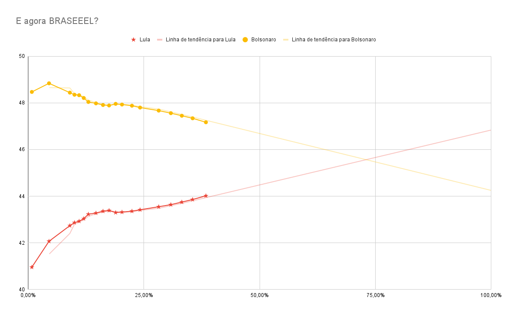

# Tendência do resultado da eleição

### No primeiro turno das eleições eu fiz um gráfico de tendência de forma manual só para conseguir visualizar melhor para onde estava caminhando a porcentagem de votos dos principais candidatos de acordo com o progresso da apuração das urnas.

### No segundo turno eu resolvi automatizar isso para aprender a usar algumas APIs (Google sheets, puppeteer, twitter).

---

### Aqui está o gráfico que gerei no primeiro turno onde pude prever ligeiramente quando Lula iria igualhar a contagem dos votos com o Bolsonaro (Com uma apuração um pouco maior eu consegui prever a porcentagem final de cada candidato).

---

O programa tem as seguintes funcionalidades

1. Entra na api do TSE para verificar os dados da apuraçao do segundo turno das eleições de 2022
1. Atualiza os dados de uma tabela do google sheets que gera automaticamente um grafico que possui uma linha de tendência com média movel, aqui está o [link público da tabela](https://docs.google.com/spreadsheets/d/12BC8k7vgbsZartBZkJmAkgA1O5UtgDxMqSJXGrEDVOo/edit?usp=sharing)
1. Faz um screenshot do gráfico
1. Faz uma postagem no twitter [@TenEleicao](https://twitter.com/TenEleicao).
1. Caso dê algo errado, ele me manda uma dm para avisar que o programa morreu
1. Caso a verificação de dar errado der errado, o servidor me manda uma dm a cada 5 minutos para a minha conta no twitter para avisar que o programa continua rodando

<!-- forever -m 100 -c ts-node src/index.ts -->
